# Ping (Client and Server)



This is a basic application which aims to experiment with Buf Schema Registry (BSR) and Cloud Native Postgres (CNPG). 

The application consists of a client and a server. The client sends a request to the server, and the server responds with a message.

## Quickstart

### Starting the Application

If you haven't already, start Minikube:

```bash
minikube start
```

Install the Kafka and Postgres operators:

```bash
skaffold run -p bootstrap
```

Next, start the remainder of the application:

```bash
skaffold dev
```

Wait for this to complete. The most important pieces will look like this:

```bash
kubectl get pods --all-namespaces
NAMESPACE      NAME                                                  READY   STATUS    RESTARTS       AGE
cnpg-system    cnpg-cloudnative-pg-5fd4d75b76-fk5d4                1/1     Running   0              98m
default        pg-cluster-1                                         1/1     Running   0              50m
default        pg-cluster-2                                         1/1     Running   0              50m
default        pg-cluster-3                                         1/1     Running   0              50m
default        server-6749f574f5-4q48x                             1/1     Running   0              37m
default        server-6749f574f5-bk66j                             1/1     Running   0              38m
default        server-6749f574f5-rs98s                             1/1     Running   0              38m
kafka-system   ping-kafka-cluster-entity-operator-7fd7475488-2ccvp  2/2     Running   0              51m
kafka-system   ping-kafka-cluster-ping-kafka-cluster-pool-0         1/1     Running   0              51m
kafka-system   ping-kafka-cluster-ping-kafka-cluster-pool-1         1/1     Running   0              51m
kafka-system   ping-kafka-cluster-ping-kafka-cluster-pool-2         1/1     Running   0              51m
kafka-system   strimzi-cluster-operator-7c54996bb7-z5kwn           1/1     Running   0              98m
```

### Interacting with the Application

#### Using curl

Send a ping:
```bash
curl -X POST http://localhost:8080/ping.v1.PingService/Ping \
     -H "Content-Type: application/json" \
     -d '{"timestamp_ms": 1728926331000}'
```

Get ping count:
```bash
curl -X POST http://localhost:8080/ping.v1.PingService/PingCount \
     -H "Content-Type: application/json" \
     -d '{}'
```

#### Using the Go client

```bash
go run . ping
go run . count
```

#### Monitoring Kafka Events

View events in the Kafka topic:
```bash
kubectl exec -it ping-kafka-cluster-ping-kafka-cluster-pool-0 -n kafka-system -- \
  bin/kafka-console-consumer.sh --bootstrap-server localhost:9092 --topic ping-events --from-beginning
```

#### Checking PostgreSQL Data

View the first 10 pings:
```bash
kubectl cnpg psql pg-cluster -- -d pingdb -c "SELECT * FROM pings LIMIT 10;"
```

Count total pings:
```bash
kubectl cnpg psql pg-cluster -- -d pingdb -c "SELECT COUNT (*) FROM pings"
```

### Clean up

Use `CTRL+C` to stop `skaffold dev`, then run:

```bash
skaffold delete -p bootstrap
minikube stop
```

## Tech Stack

| Technology                                                                                                                                                              | Purpose                                                               |
|-------------------------------------------------------------------------------------------------------------------------------------------------------------------------|-----------------------------------------------------------------------|
| [Go](https://go.dev/)                                                                                                                                                   | Programming language used for the application                         |
| [ConnectRPC](https://connectrpc.com/)                                                                                                                                   | Framework for remote procedure calls                                  |
| [Protocol Buffers](https://protobuf.dev/)                                                                                                                               | Serialization format used with ConnectRPC                             |
| [Buf](https://buf.build/)                                                                                                                                               | Tool for working with Protocol Buffers                                |
| [Buf Schema Registry](https://buf.build/product/bsr)                                                                                                                    | Registry for storing and managing Protocol Buffers schemas            |
| [Docker](https://www.docker.com/)                                                                                                                                       | Containerization platform                                             |
| [Kubernetes](https://kubernetes.io/)                                                                                                                                    | Container orchestration platform                                      |
| [Minikube](https://minikube.sigs.k8s.io/docs/start/?arch=%2Fmacos%2Farm64%2Fstable%2Fbinary+download) (or [Kind](https://kind.sigs.k8s.io/), or whatever else you have) | Tool for running a local Kubernetes cluster                           |
| [Skaffold](https://skaffold.dev/)                                                                                                                                       | Tool for building and deploying applications on Kubernetes            |
| [Postgres](https://www.postgresql.org/)                                                                                                                                 | Relational database management system                                 |
| [CloudNativePG](https://cloudnative-pg.io/)                                                                                                                             | Operator for managing PostgreSQL on Kubernetes                        |
| [pgx](https://github.com/jackc/pgx)                                                                                                                                     | PostgreSQL driver and toolkit for Go                                  |
| [Apache Flink](https://flink.apache.org/)                                                                                                                               | Stream processing framework for real-time analytics                   |
| [DragonflyDB](https://dragonflydb.io/)                                                                                                                                 | High-performance Redis-compatible in-memory store                     |
| [Orbstack](https://orbstack.dev/) (or [Docker Desktop](https://www.docker.com/products/docker-desktop/))                                                                | Virtualized environment for running containers                        |

## Data Flow & Consistency Model

The application uses an eventually consistent model for ping counts:

1. When a ping is received:
   - It is immediately stored in PostgreSQL (durable storage)
   - A ping event is published to Kafka
   - The current count is read from DragonflyDB cache

2. The Flink ping-processor:
   - Consumes ping events from Kafka
   - Maintains running counts with buffered writes to DragonflyDB
   - Uses a 1000-record or 1-second buffer (whichever comes first)
   - Provides exactly-once processing guarantees

3. Count retrieval behavior:
   - First attempts to read from DragonflyDB cache
   - Falls back to PostgreSQL if cache is unavailable
   - May be slightly delayed due to buffered processing

Example interaction showing eventual consistency:

```bash
# Send 3 pings in quick succession
curl -X POST http://localhost:8080/ping.v1.PingService/Ping \
     -H "Content-Type: application/json" \
     -d '{"timestamp_ms": 1728926331000}'
curl -X POST http://localhost:8080/ping.v1.PingService/Ping \
     -H "Content-Type: application/json" \
     -d '{"timestamp_ms": 1728926332000}'
curl -X POST http://localhost:8080/ping.v1.PingService/Ping \
     -H "Content-Type: application/json" \
     -d '{"timestamp_ms": 1728926333000}'

# First count might show 0 or partial count while Flink processes the batch
curl -X POST http://localhost:8080/ping.v1.PingService/PingCount \
     -H "Content-Type: application/json" \
     -d '{}'

# After ~1 second, count will show all 3 pings
curl -X POST http://localhost:8080/ping.v1.PingService/PingCount \
     -H "Content-Type: application/json" \
     -d '{}'
```

You can observe the Flink processing in real-time:

```bash
kubectl logs -f deployment/ping-processor
```

And monitor the cache state:

```bash
kubectl exec -it ping-cache-0 -- redis-cli HGETALL ping:counters
```
