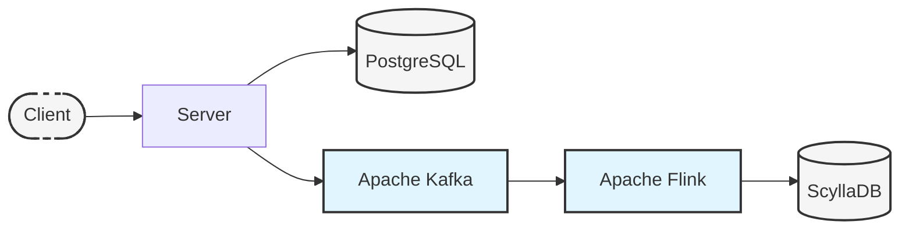

# v1: Learning Stream Processing

`v1` introduces stream processing through a series of educational modules, each building on the previous one to create a real-time ping visualization system.

## Abstract

This RFC proposes adding stream processing capabilities to the ping service in an educational, step-by-step manner. The end goal is to create a real-time ping heatmap showing usage patterns, while teaching core streaming concepts.

## Background

The current system stores ping events in PostgreSQL. While this works for basic storage, we'll extend it to handle real-time processing through a series of learning modules.

## Learning Modules

### Module 1: Kafka Basics

- Deploy Kafka using Strimzi operator
- Modify server to write to both PostgreSQL and Kafka
- Build simple console consumer
- **Learning Outcomes**: Kafka basics, operators, event patterns

### Module 2: Stream Processing with Flink

- Deploy Flink on Kubernetes
- Create basic processing job
- Calculate ping frequency per minute
- **Learning Outcomes**: Stream processing fundamentals

### Module 3: Data Visualization

- Deploy ScyllaDB for time-series storage
- Store processed metrics
- Create real-time heatmap visualization
- **Learning Outcomes**: Time-series data, NoSQL concepts

## High-Level Design

### Current Architecture

```plaintext
Client → Server → PostgreSQL
```

### Final Architecture

```plaintext
Client → Server → PostgreSQL
              ↘ Kafka → Flink → ScyllaDB → Heatmap UI
```



## Implementation Plan

### Phase 1: Kafka Integration

#### Module 1 Implementation

1. **Kafka Setup**
   - Deploy Strimzi operator
   - Create `ping-events` topic
   - Setup basic monitoring

2. **Server Changes**
   - Add Kafka producer
   - Implement dual-write pattern
   - Add basic health checks

3. **Learning Exercises**
   - Build console consumer
   - Experiment with partitions
   - Monitor event flow

#### Module 2 Implementation

1. **Flink Setup**
   - Deploy Flink operator
   - Create basic job template
   - Setup monitoring

2. **Processing Logic**
   - Calculate events per minute
   - Implement sliding windows
   - Output to Kafka topic

3. **Learning Exercises**
   - Modify window sizes
   - Add simple aggregations
   - Monitor processing lag

#### Module 3 Implementation

1. **ScyllaDB Setup**
   - Deploy operator
   - Create time-series schema
   - Configure retention

2. **Visualization**
   - Store processed metrics
   - Create basic UI
   - Display heatmap

3. **Learning Exercises**
   - Query patterns
   - Data retention
   - UI interactions

## Technical Details

### Kafka Configuration

```yaml
topics:
    - name: ping-events
      partitions: 3
      replication-factor: 3
      configs:
        retention.ms: 86400000  # 24 hours
        cleanup.policy: delete
```

### ScyllaDB Schema

```sql
CREATE KEYSPACE IF NOT EXISTS metrics
WITH replication = {'class': 'NetworkTopologyStrategy', 'replication_factor': 3};

CREATE TABLE metrics.heatmap_data (
    time_bucket timestamp,
    minute int,
    hour int,
    ping_count int,
    PRIMARY KEY ((hour), minute, time_bucket)
) WITH CLUSTERING ORDER BY (minute ASC, time_bucket DESC);
```

### Example Implementations

#### Basic Server with Kafka

```go
func (s *PingServiceServer) Ping(ctx context.Context, req *connect.Request[pingv1.PingRequest]) (*connect.Response[pingv1.PingResponse], error) {
    timestamp := time.Unix(0, req.Msg.TimestampMs*int64(time.Millisecond)).UTC()
    
    // Store in PostgreSQL
    if err := s.storeInPostgres(ctx, timestamp); err != nil {
        return nil, err
    }
    
    // Send to Kafka
    if err := s.sendToKafka(ctx, timestamp); err != nil {
        // Log error but don't fail request
        log.Printf("kafka publish failed: %v", err)
    }
    
    return connect.NewResponse(&pingv1.PingResponse{}), nil
}
```

#### Simple Flink Job

```java
public class PingHeatmapJob {
    public static void main(String[] args) throws Exception {
        StreamExecutionEnvironment env = StreamExecutionEnvironment.getExecutionEnvironment();

        // Read from Kafka
        DataStream<PingEvent> events = env.addSource(
            new FlinkKafkaConsumer<>("ping-events", new JSONDeserializationSchema(), properties)
        );
        
        // Count pings per minute
        DataStream<MinuteCount> counts = events
            .keyBy(event -> event.getMinute())
            .timeWindow(Time.minutes(1))
            .aggregate(new CountAggregator());
            
        // Output results
        counts.addSink(new KafkaSink<>("ping-metrics"));
        
        env.execute("Ping Heatmap");
    }
}
```

### Learning Resources

1. **Kafka Basics**
   - Kafka architecture
   - Topics and partitions
   - Producer/Consumer patterns

2. **Stream Processing**
   - Windows and watermarks
   - State management
   - Exactly-once processing

3. **Time Series Data**
   - Data modeling
   - Efficient queries
   - Visualization techniques

### Development Workflow

1. Start with local development
2. Move to Kubernetes gradually
3. Focus on one concept at a time
4. Include plenty of monitoring

### Dependencies

- Kubernetes cluster
- Strimzi operator
- Flink operator
- ScyllaDB operator
- Basic monitoring stack
