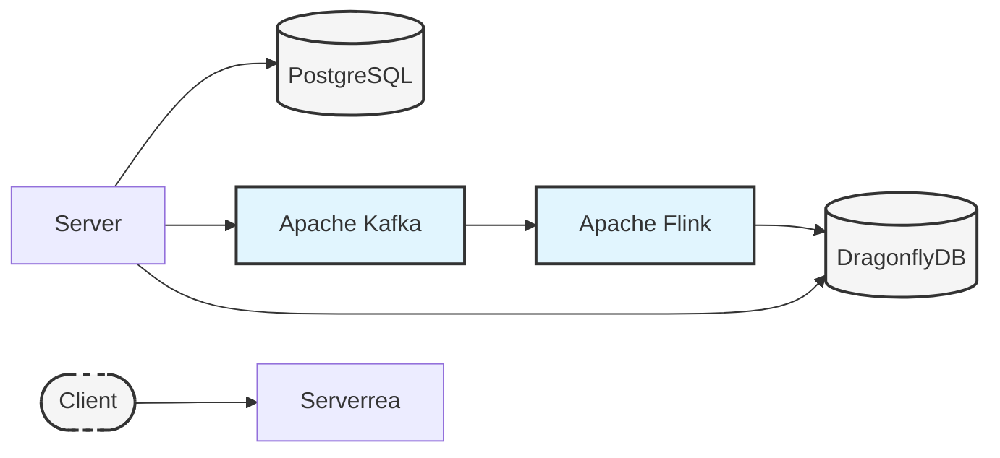

# Ping v2

## Architecture Diagram

```mermaid
flowchart LR
    Client([Client])
    Server[Server]
    PG[(PostgreSQL)]
    Kafka[Apache Kafka]
    Flink[Apache Flink]
    DragonflyDB[(DragonflyDB)]
    
    Client --> Serverrea
    Server --> PG
    Server --> Kafka
    Server --> DragonflyDB
    Kafka --> Flink
    Flink --> DragonflyDB
    
    classDef database fill:#f5f5f5,stroke:#333,stroke-width:2px
    classDef processing fill:#e1f5fe,stroke:#333,stroke-width:2px
    classDef client fill:#f5f5f5,stroke:#333,stroke-width:2px,stroke-dasharray: 5 5
    
    class PG,DragonflyDB database
    class Kafka,Flink processing
    class Client client
```