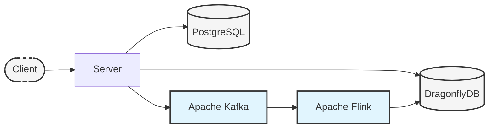

# Ping v2

This service implements a ping counter with real-time processing capabilities. It uses a combination of PostgreSQL for durable storage, Apache Kafka for event streaming, Apache Flink for stream processing, and DragonflyDB for high-performance caching.

## Key Components

- **PostgreSQL**: Primary storage for ping records
- **Apache Kafka**: Event streaming platform for ping events
- **Apache Flink**: Stream processing engine that consumes ping events and updates aggregated counts
- **DragonflyDB**: High-performance in-memory cache storing real-time ping counts

## Architecture Overview

The system follows an event-driven architecture with the following flow:

1. Client sends ping request to Server
2. Server:
   - Stores ping record in PostgreSQL
   - Publishes ping event to Kafka
   - Reads current count from DragonflyDB cache
3. Flink:
   - Processes ping events from Kafka
   - Maintains running counts using buffered writes to DragonflyDB
   - Provides per-minute aggregations with a 1-hour sliding window

## Architecture Diagram

## Design Decisions

### DragonflyDB Integration

DragonflyDB was chosen as the caching layer for several reasons:
- High performance: Optimized for in-memory operations
- Redis protocol compatibility: Allows easy integration with existing Redis clients
- Kubernetes-native: First-class support via the DragonflyDB Operator
- Simple deployment: Minimal operational overhead compared to Redis Cluster

The Flink job implements efficient buffered writes to DragonflyDB:
- Batches up to 1000 records
- Maximum 1 second delay before flush
- Automatic retry mechanism
- Exactly-once processing guarantees
- Maintains sliding window counters

### Database Selection

Initially, ScyllaDB was considered as the primary database but was ultimately replaced with PostgreSQL due to:
- Complexity of the ScyllaDB Operator in Kubernetes
- Higher operational overhead
- More complex deployment and maintenance requirements
- PostgreSQL offering sufficient performance for our use case

PostgreSQL provides:
- Proven reliability
- Simpler operations
- Native Kubernetes support via CloudNativePG
- Familiar SQL interface
- Rich ecosystem of tools and extensions
